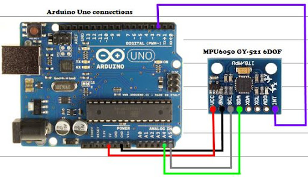

# MPU6050 Kalman Filter

Stochastic Processes Final Project
EE 525, Fall 2024, Clay McKell

- Braedan Kennedy (bkenne07@calpoly.edu)
- Luis David Garcia (lgarc120@calpoly.edu)

## Connection Diagram

  
Diagram from [42bots.com](https://42bots.com/tutorials/arduino-uno-and-the-invensense-mpu-6050-6dof-imu/)

## Installation

1. Install [Arduino IDE](https://www.arduino.cc/en/software)
2. Install [Adafruit MPU6050 Library](https://github.com/adafruit/Adafruit_MPU6050)
3. Open and upload `src/Arduino/main/main.ino` via Arduino IDE

## Log Data

### Putty (Windows)
1. Install [Putty](https://www.putty.org/)
2. Open with options:
    - Connection type : Serial
    - Speed : 115200
    - Serial line : [Arduino COM port]
    - Session logging : Printable output
    - Log file name : [A valid file name]

### Logger Script (Linux/OSX)
1. Activate environment:  
 `source .venv/bin/activate`
2. Run the script and capture output:  
 `python3 src/Python/logger.py | tee FILENAME.csv`

#### WSL2 Note (Windows)
To run the logger script from a WSL2 instance you need to follow a few extra steps:  
1. Install [usbipd](https://github.com/dorssel/usbipd-win)
2. Forward Arduino serial port to WSL2 instance by running `usbipd list` then `usbipd attach --wsl --busid=BUSID` for the correct BUSID

## Misc Notes
 - Skip pre-commit hooks using the `-n` flag when running `git commit`
